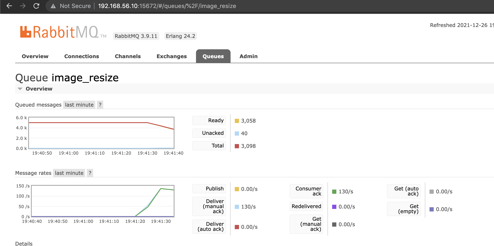
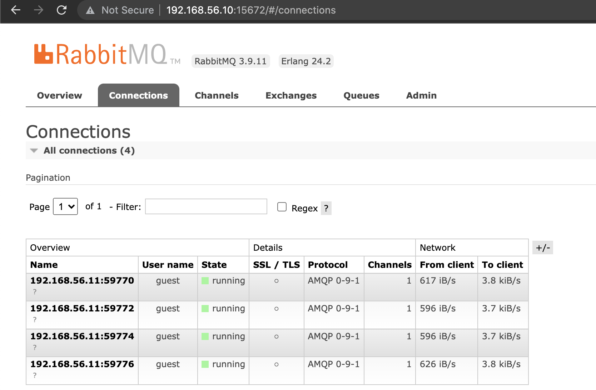
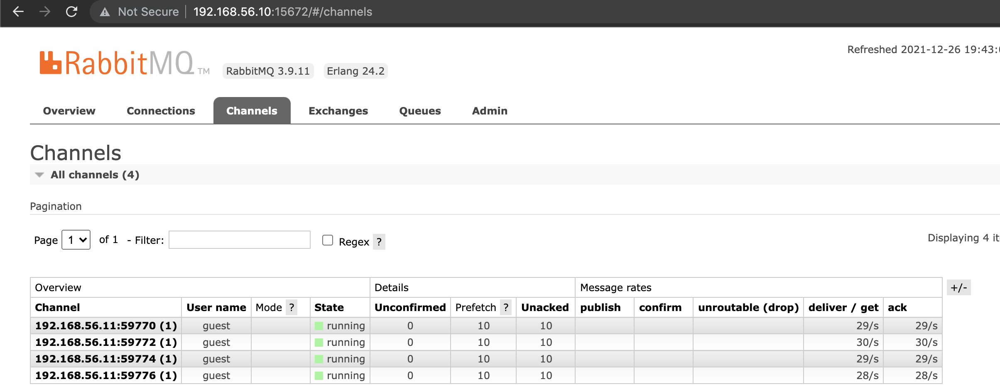

# Clustered Consumer

It consumes the messages from the rabbitmq instance through multiple child processes.

## Build
Run the following command to start building docker image

```aidl
./build.sh
```

## Run
Run the following script to consume the messages from the rabbitmq instance.

```aidl
./run.sh
```

# How To Check

Open your favorite browser and go to the rabbitmq console by visiting [http://192.168.56.10:15672/#/queues/%2F/image_resize](http://192.168.56.10:15672/#/queues/%2F/image_resize) . You can use **username**: guest and **password**: guest to log-in to the rabbitmq console.
You'll see that the messages in the queue are going to be decreased.



Also, you can see that there multiple connections and the channels created by each child process while the consumer is running.

**Connections:**



**Channels**

