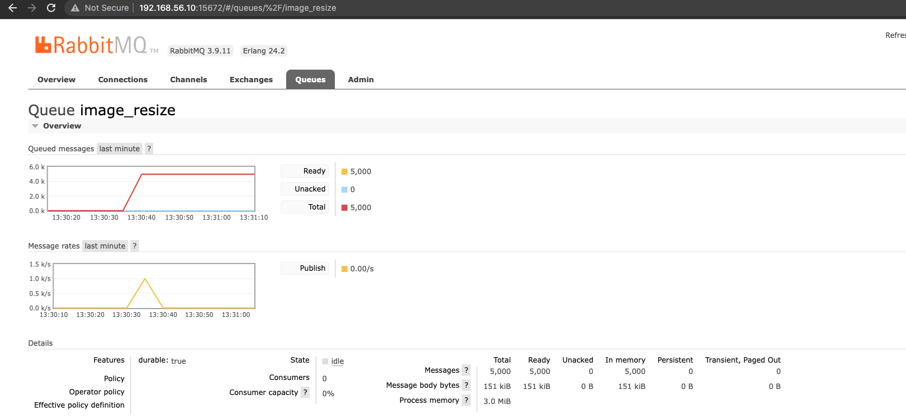

# Create Sample Message

It helps to create sample messages on RabbitMQ

## Build
Run the following command to start building docker image

```shell
$ ./build.sh
```

## Run
Run the following script to produce sample images on the rabbitmq instance.

```shell
$ ./run.sh
```

**Output:**

```shell
> create-sample-messages@1.0.0 start
> node create-sample-messages.js

Creating sample messages...
Done!
```

## How To Check
Open your favorite browser and go to the rabbitmq console by visiting [http://192.168.56.10:15672/#/queues/%2F/image_resize](http://192.168.56.10:15672/#/queues/%2F/image_resize) . You can use **username**: guest and **password**: guest to log-in to the rabbitmq console.


