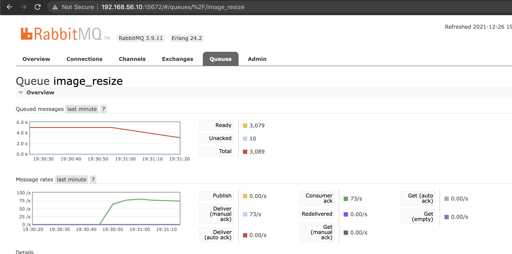
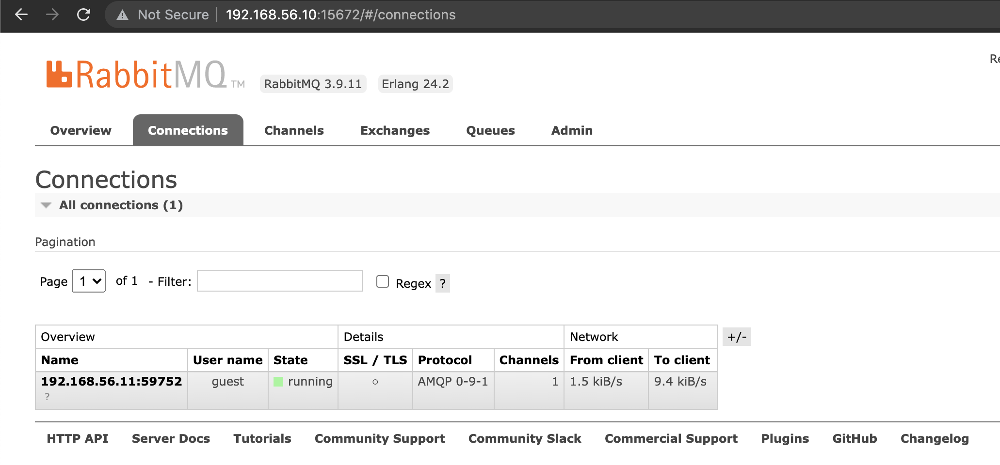
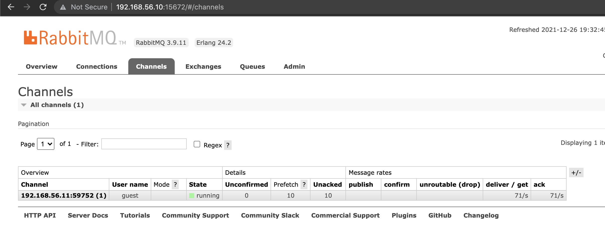

# Simple Consumer

The implementation allows consuming messages in the rabbbitmq instance in a simple way with one single process.

## Build
Run the following command to start building docker image

```shell
$ ./build.sh
```

## Run
Run the following script to consume the messages from the rabbitmq instance.

```shell
$ ./run.sh
```

The process will block the terminal until breaking it by **CTRL+C**.

## How To Check

Open your favorite browser and go to the rabbitmq console by visiting [http://192.168.56.10:15672/#/queues/%2F/image_resize](http://192.168.56.10:15672/#/queues/%2F/image_resize) . You can use **username**: guest and **password**: guest to log-in to the rabbitmq console.
You'll see that the messages in the queue are going to be decreased.



Also, you can see that there is only a single connection and a channel for that connection created while the consumer is running.

**Connections:**



**Channels**

